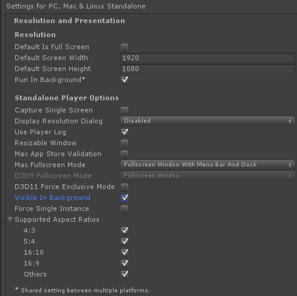

<div id="article_content" class="article_content"
style="margin: 35px 0px; color: rgb(85, 85, 85); line-height: 35px; font-family: 'microsoft yahei'; font-variant-ligatures: normal; orphans: 2; widows: 2;">

<div class="markdown_views" style="font-size: 14px;">

环境：Win7 64bit, Unity3D 4.6.2

``` {.prettyprint name="code" style="white-space: nowrap; word-wrap: break-word; box-sizing: border-box; position: relative; overflow-y: hidden; overflow-x: auto; margin-top: 0px; margin-bottom: 1.1em; font-family: 'Source Code Pro', monospace; padding: 5px 5px 5px 60px; line-height: 1.45; word-break: break-all; color: rgb(51, 51, 51); border: 1px solid rgba(128, 128, 128, 0.0745098); border-radius: 0px; background-color: rgba(128, 128, 128, 0.0470588);"}
using System;
using System.Collections;
using System.Runtime.InteropServices;
using System.Diagnostics;
using UnityEngine;
using System.Xml.Serialization;

public class WindowMod : MonoBehaviour
{
    [HideInInspector]
    public Rect screenPosition;
    [DllImport("user32.dll")]
    static extern IntPtr SetWindowLong(IntPtr hwnd, int _nIndex, int dwNewLong);
    [DllImport("user32.dll")]
    static extern bool SetWindowPos(IntPtr hWnd, int hWndInsertAfter, int X, int Y, int cx, int cy, uint uFlags);
    [DllImport("user32.dll")]
    static extern IntPtr GetActiveWindow();
    const uint SWP_SHOWWINDOW = 0x0040;
    const int GWL_STYLE = -16;
    const int WS_BORDER = 1;
    private int i = 0;

    void Start()
    {
        SetWindowLong(GetActiveWindow(), GWL_STYLE, WS_BORDER);
        SetWindowPos(GetActiveWindow(), -1, (int)screenPosition.x, (int)screenPosition.y, (int)screenPosition.width, (int)screenPosition.height, SWP_SHOWWINDOW);
    }

    void Update()
    {
        i++;
        if(i<5)
        {
            SetWindowLong(GetActiveWindow(), GWL_STYLE, WS_BORDER);
            SetWindowPos(GetActiveWindow(), -1, (int)screenPosition.x, (int)screenPosition.y, (int)screenPosition.width, (int)screenPosition.height, SWP_SHOWWINDOW);
        }
    }
}12345678910111213141516171819202122232425262728293031323334353637381234567891011121314151617181920212223242526272829303132333435363738
```

 \
上图，Build设置 \
用这个脚本，可以使Unity3D窗口全屏，没有标题栏，通过更改screenPosition的值，还可以使窗口直接在第二个屏幕上启动（x=0,
y=0, width=1920, height=1080），或者窗口跨越两个屏（x=0, y=0,
width=3840, height=1080）。 \
Windows系统会记录每个软件的窗口大小和位置，记录在注册表的\\HKEY\_CURRENT\_USER\\Software\\xxx\\yyy
位置，xxx是Unity3D在build设置中的Company
Name，yyy是在Build设置中的Product
Name。所以如果有时候窗口大小有问题，可以先备份注册表，再删除xxx项。建议每个项目的Product
Name不要用默认值，否则打包出来的软件都会对应到注册表里相同的项。

\

</div>

</div>
