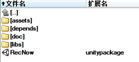
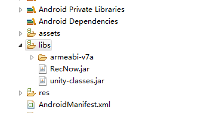
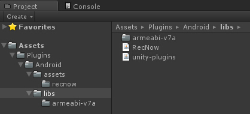
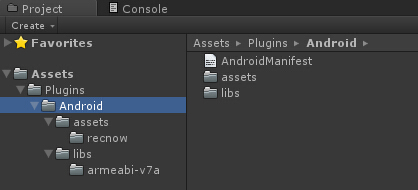

**爱拍手游录像引擎RecNow-说明文档-Android**

****

 

[1.      概述... 2](#_Toc435192717)

[2.      资源预览... 2](#_Toc435192718)

[3.      一般Android项目接入... 2](#_Toc435192719)

[3.1        拷贝资源... 3](#_Toc435192720)

[3.2        导入动态库... 3](#_Toc435192721)

[3.3        修改AndroidManifest文件... 3](#_Toc435192722)

[3.4        调用初始化方法... 4](#_Toc435192723)

[3.5        代码混淆... 5](#_Toc435192724)

[3.6        调用底层C++接口... 5](#_Toc435192725)

[3.7        设置初始化回调接口... 6](#_Toc435192726)

[4.      API介绍... 6](#_Toc435192727)

[4.1      C++ API 6](#_Toc435192728)

[4.2      Java API 7](#_Toc435192729)

[5.      unity3d接入... 8](#_Toc435192730)

[5.1        unity3d导出Android项目接入... 9](#_Toc435192731)

[5.2        unity editor中直接编译接入... 9](#_Toc435192732)

[5.3        unity3d API 11](#_Toc435192733)

****

 

****

 

****

 

****

 

[1.  概述]()
============

RecNow手游录像引擎针对手游录像和快速分享提供了一整套的解决方案，它包含有四大组件：手游录像、社交分享、积分系统、以及视频社区。

RecNow支持基于OpenGL ES的游戏引擎，比如Cocos2d-x、 Unity3d 以及其它的游戏引擎。 通过硬件加速的方式实现快速取图，不会对游戏体验造成影响。

RecNow提供了多种模式供厂商接入，包括快速接入模式、自定义模式；在快速接入模式下，厂商只需要添加几行代码，简单的配置一下AndroidManifest文件，在几分钟内就可以迅速的完成接入工作；在自定义模式下，厂商可以根据自己的需求调用RecNow提供的API实现定制功能。

unity3d游戏的接入有点特别，所以对unity3d的游戏接入有单独介绍。

[2.  资源预览]()
================

       解压资源包RecNow.(version).zip，RecNow包含的资源件如图所示：

       

       assets包含需要拷贝到Android项目的assets目录下的资源；
           depends包含C++ API头文件以及动态库资源；
           doc 包含说明文档；
           libs 包含jar库；
    RecNow.unitypackage 包含unity3的 C\# API。

[3.  一般Android]()项目接入
===========================

假定RecNow解压目录是RecNow，游戏的主目录是SimpleGame。

[3.1拷贝资源]()

拷贝RecNow/assets/recnow目录到SimpleGame/assets目录下；

拷贝RecNow/libs/RecNow.jar到SimpleGame/libs目录下。

注意，如果是cocos2dx游戏，它的build\_native每次编译时会自动删除assets目录下的资源，对于cocos2dx游戏建议在build\_native脚本里面拷贝assets资源。

[3.2导入动态库]()

拷贝RecNow/depends/lib/librecnow.so到SimpleGame/libs/armeabi-v7a或者SimpleGame/libs/armeabi下，具体选择根据游戏而定。

注意，Android每次编译native代码时会自动删除掉libs下的动态库，然后重新生成，所以一定要确保在编译完native代码后，都要拷贝librecnow.so到libs目录下，否则游戏启动时会因为找不到librecnow.so动态库而崩溃。

[3.3修改AndroidManifest]()文件

在AndroidManifest文件中配置RecNow权限以及所需的参数，具体配置如下：

[TABLE]

meta-data参数说明：

**aipai.gameid**：代表游戏在爱拍官方注册的游戏id；关于申请游戏id，请与爱拍官方联系获取游戏id（QQ：1875548859），独立的游戏id更利于游戏的宣传和推广。如果未获得游戏id，可使用-1；

**aipai.apk-channel**：游戏的不同渠道版本，渠道码值由爱拍官方规定，请参考爱拍官方的规则（<http://shouyou.aipai.com/shouyouqudao>）；

**aipai.game-activity**：游戏的主Activity类名，因为RecNow需要监听游戏主Activity的生命周期，以便正确的设置录像状态，因此必须把游戏的主Activity类名作为参数传入；例如SimpleGame的主Activity类名是com.aipai.simplegame.SimpleGameActivity。

[3.4调用初始化方法]()

假设SimpleGame的launcher Activity是 com.aipai.simplegame.LuncherActivity，在LuncherActivity的onCreate方法中调用RecNow的初始化方法，初始化时需要传入Application实例：

[TABLE]

[3.5代码混淆]()

注意，如果需要混淆代码，为了保证RecNow的正常使用，需要在proguard-project.txt加上下面几行配置：

[TABLE]

[3.6调用底层C++]()接口

C++接口在librecnow.so中，下面是链接动态库的示例代码，假设RecNow解压到项目的recnow目录中，在项目的Android.mk文件中添加如下代码：

[TABLE]

注意，因为游戏依赖librecnow.so，所以要在加载libgame.so之前先加载librecnow.so，具体代码如下

[TABLE]

[3.7设置初始化回调接口]()

RecNow提供的功能，只有在初始化完成之后才会生效，可以通过监听RecNow初始化完成的事件来实现。可以在调用RecNow.initializeWithApplication的时候传一个回调接口来接收初始化完成消息；如果不需要可以设置成null。

[TABLE]

[4.  API]()介绍
===============

4.1 [C++ API]()

C++ API在 RecNow.h头文件中

**return**

** declaration**

**bool**

**RecNow\_IsEnabled**()

判断设备是否支持，支持返回ture，否则返回false

**const char\***

**RecNow\_GetVideoPath**()

返回当前录像的视频保存路径

**int**

**RecNow \_StartRecord**()

开始录像，返回值不为0，表示开始录像失败

**void **

**RecNow \_StopRecord**()

停止录像

**void**

**RecNow \_PauseRecord**()

暂停录像

**void **

**RecNow \_ResumeRecord**()

恢复录像

**void**

**RecNow \_ShowVideoStore**()

显示recnow自带的视频管理界面

**void**

**RecNow \_DeleteVideo**(const char\* path)

删除最近一次录的视频文件

**void**

**RecNow \_Playback**(const char\* path)

回放最近一次录的视频

**void**

**RecNow \_FastShare**(const char\* path)

快速分享最近一次录的视频

**void**

**RecNow \_ShowPlayerClub**()****

进入爱拍recnow玩家俱乐部

**void**

**RecNow \_ShowWelfareCenter**()****

进入爱拍recnow福利中心

4.2 [Java API]()

Java API在com.aipai.recnow.RecNow类中

**return**

**declaration**

**static boolean**

**isEnabled**()

判断设备是否支持，支持返回ture，否则返回false

**static String**

**getVideoPath**()

返回当前录像的视频保存路径

**static int**

**startRecord**()

开始录像，返回值不为0，表示开始录像失败

**static void**

**stopRecord**()

停止录像

**static void**

**pauseRecord**()

暂停录像

**static void**

**resumeRecord**()

恢复录像

**static void**

**showVideoStore**()

显示recnow自带的视频管理界面

**static void**

**setOnStartListener**(OnStartListener listener)

设置开始录像listener

**static void**

**setOnStopListener**(OnStopListener listener)

设置停止录像listener

**static void**

**setOnPauseListener**(OnPauseListener listener)

设置暂停录像listener

**static void**

**setOnResumeListener**(OnResumeListener listener)

设置恢复录像listener

**static void **

**deleteVideo**(**String** path)

删除最近一次录的视频文件

**static void**

**playback**(**String **path)

回放最近一次录的视频

**static void**

**fastShare**(**String** path)

快速分享最近一次录的视频

**static void**

**showPlayerClub**()

进入爱拍recnow玩家俱乐部

**static void**

**showWelfareCenter**()

进入爱拍recnow福利中心

[5.unity3d]()接入
=================

unity3d游戏接入有两种情况：
    1）一种是通过导出Android项目，然后编译游戏；
    2）另一种是直接在unity editor中编译游戏。

[5.1unity3d]()导出Android项目接入

如果游戏是通过导出Android项目编译的，接入方法和前面介绍的一般Android项目接入方法相同，按照之前介绍的方法接入即可。

[5.2unity editor]()中直接编译接入

如果游戏直接在unity editor中编译，接入方法有点特别，下面介绍如何在unity editor中直接编译接入方法。

首先需要有一个Android lib project。 如果还没有，就从空白Unity项目导出一个Android lib project。如果已经接入了其它的SDK，可以在原有的project 中做相应的修改。具体步骤如下：

1）Android lib project的package name 必须和Unity的 Bundle Identifier一样（如果已经接入其它SDK跳过）；

2) 拷贝RecNow.jar到project的libs 目录下；如果libs目录下没有unity-classes.jar，就从Unity的安装目录找到class.jar复制到libs目录下，Mac下classes.jar的路径是/Applications/Unity/Unity.app/Contents/PlaybackEngines/AndroidPlayer/bin/classes.jar，Windows下classes.jar的路径是Unity\\Editor\\Data\\PlaybackEngines\\androidplayer\\bin\\classes.jar；

 

3) 修改AndroidManifest.xml: 参考之前的说明；

4) 修改launcher Activity的onCreate方法: 参考之前的说明；

5) 编译project ；

6) 在project 目录下执行:

    jar -cvfM unity-plugins.jar -C bin/classes/ .

7) 拷贝unity-plugins.jar 到Unity项目的 Assets/Plugins/Android/libs目录下；

8）拷贝project的AndroidManifest.xml到Unity项目的 Assets/Plugins/Android目录下；

9）拷贝RecNow/libs/RecNow.jar 到Unity项目的Assets/Plugins/Android/libs目录下；

10）拷贝RecNow/depends/lib/librecnow.so 到Unity项目的Assets/Plugins/Android/libs/armeabi-v7a 目录下；

11）拷贝RecNow/asssets/recnow到Unity项目的Assets/Plugins/Android/assets目录下；

12）编译游戏。

[5.3unity3d API]()

RecNow提供了C\# API给厂商调用，使用时首先需要导入RecNow.unitypackage。

unity3d API在aipai. RecNow类中

**return**

**declaration**

**static bool**

**IsEnabled**()

判断设备是否支持，支持返回ture，否则返回false

**static string**

**GetVideoPath**()

返回当前录像的视频保存路径

**static int**

**StartRecord**()

开始录像，返回值不为0，表示开始录像失败

**static void**

**StopRecord**()

停止录像

**static void**

**PauseRecord**()

暂停录像

**static void**

**ResumeRecord**()

恢复录像

**static void**

**ShowVideoStore**()

显示recnow自带的视频管理界面

**static void**

**Playback**(**string **path)

回放最近一次录的视频

**static void**

**FastShare**(**string** path)

快速分享最近一次录的视频

**static void**

**ShowPlayerClub**()

进入爱拍recnow玩家俱乐部

**static void**

**ShowWelfareCenter**()

进入爱拍recnow福利中心

 
