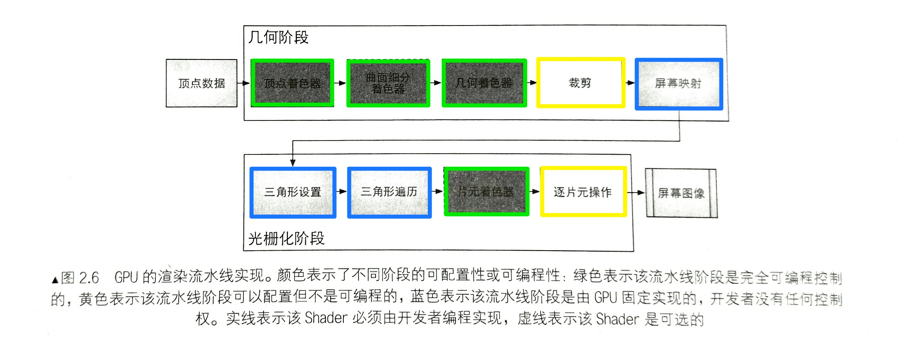

渲染流程主要分为三个阶段：应用阶段、几何阶段、光栅化阶段。

\

应用阶段是由CPU负责实现，大致可以分为以下三个阶段：

\(1) 把数据加载到显存中。

\(2) 设置渲染状态。

\(3) 调用Draw Call（通知GPU按照设置对准备好的数据进行渲染）。

\

几何阶段和光栅化阶段都是由GPU来实现，GPU通过实现流水线化，大大加快渲染速度，下图展示了各个流水线阶段：

\

GPU的渲染流水线接受顶点数据作为输入，被传递给顶点着色器。

\

几何阶段

顶点着色器：通常用于实现顶点的空间变换、顶点着色等功能。

曲面细分着色器：用于细分图元。

几何着色器：用于执行逐图元的着色操作，或者被用于产生更多的图元。

裁剪：将那些不在摄像机视野内的顶点裁剪掉，并剔除某些三角图元的片面。

屏幕映射：负责把每个图元的坐标转换到屏幕坐标系中。

\

光栅化阶段

三角形设置和三角形遍历阶段是固定函数的阶段。

片段着色器：用于实现逐片段的着色操作。

逐片段操作：负责执行很多重要的操作，如颜色修改、深度缓冲、进行混合等。

\

其中有两个非常重要的着色器是需要我们来编程的，顶点着色器和片段着色器。

\

顶点着色器的处理单位是顶点，对于输入的每个顶点将调用一次顶点着色器。顶点着色器的主要工作有：坐标变换和逐顶点光照，并输出后续阶段所需的数据。

\

\

\

顶点着色器从GPU前端模块（寄存器）中提取图元信息（顶点位置、法线向量、纹理坐标等），并完成顶点坐标空间转换、法向量控件转换、光照计算等操作，最后将计算好的数据坐标传送到指定寄存器中；然后片段着色器从中获取需要的数据，通常为”纹理坐标、光照信息等“，并根据这些信息以及从应用程序传递的纹理信息（如果有的话）进行每个片段的颜色计算，最后将处理后的数据送到光栅操作模块。

